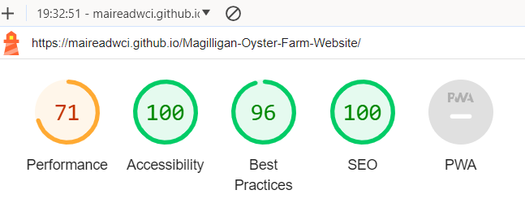
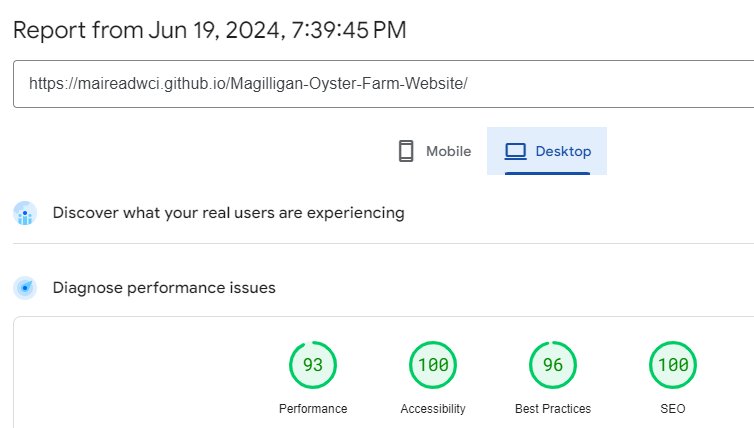
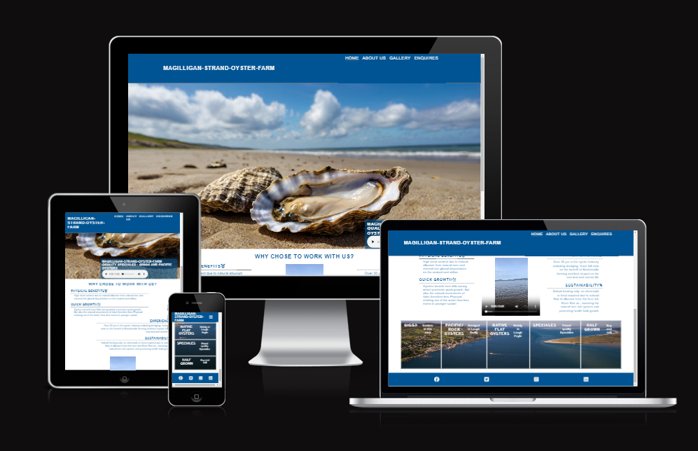
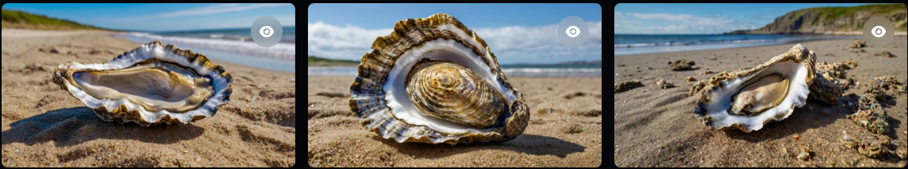

# Magilligan Oyster Farm

Welcome to Magilligan Oyster Farm, a family-owned business dedicated to cultivating high-quality oysters in the Lough Foyle area. Our oysters are known for their exceptional taste and texture, and we take pride in our sustainable farming practices.

## About Us

We have over 30 years of experience in the oyster industry, including dredging. Our expertise in sustainable farming practices ensures that our oysters are grown with minimal impact on the seabed and marine life.

## Our Oysters

### Gigga Oysters
Our Gigga oysters are renowned for their high meat content, which is a result of the natural alluvium and mineral-rich glacial deposits in the Lough Foyle area. These oysters also benefit from the natural movements of the tides, which promote quick growth and less physical trauma.

### Pacific Oysters
Our Pacific oysters are dredged from Lough Swilly, where they thrive in the nutrient-rich waters. These oysters are known for their exceptional flavor and texture.

### Native Flat Oysters
We also cultivate native flat oysters, which are primarily found in Lough Foyle. These oysters are a true delicacy and are highly sought after by discerning customers.

## Why Choose Magilligan Oyster Farm?

### Experience
With over 30 years of experience in the oyster industry, including dredging, we have a deep understanding of sustainable farming practices and the benefits of minimizing the impact on the seabed and marine life.

### Sustainability
We use natural feeding methods, relying on the natural flow of alluvium from the iron-rich River Roe to boost the natural iron content and promote healthy growth in our oysters. We do not use any chemicals or additional feed.

### Contact Us
For all inquiries, please contact us at:

Magilligan Oyster Farm
Email: info@magilliganoysters.com

Visit the deployed website <a href="https://maireadwci.github.io/Magilligan-Oyster-Farm-Website/" rel="no-follow">here

##Table of Contents
###User Experience (UX)
1. Goals
2. User stories
3. Color Scheme
4. Typography
5. Wireframes.

## UX.1.Goals
https://docs.google.com/document/d/14p_OkuVETSkwAEcmhyA3MSAHjsIHavdmzmFHj7FhHOs/edit?usp=sharing (Spec Doc for project 1)

Visit Spec Doc <a href="https://docs.google.com/document/d/14p_OkuVETSkwAEcmhyA3MSAHjsIHavdmzmFHj7FhHOs/edit?pli=1" rel="no-follow">here

## UX.2.User Stories
<ul>
<li>As a customer, I want be able to navigate through the website clearly</li>
<li>As a customer, I want to understand what quality the product are and how this is achieved</li>
<li>As a customer, I want to be able to contact the company to clarify information and negotiate sales</li>
<li>As a customer, I want to find social media links to the business</li>
<li>As a customer, I want to learn more about the company and the product and services offered </li>
<ul>

## UX.3.Color Scheme

Colours were chosen to represent the feel of the Ocean

## UX.5.Wireframes

<a href="https://balsamiq.com/" rel="nofollow">Balsamiq</a> was used to create a preview of layout and placement of the required elements

 WireFrame - Balsamiq 
 
 
 
 
 

Boiler plate html added 
index.html added
Favicon unsuccessful add
assets folder created

Favicon issue resolved had to unzip before adding. 
added links for fav icons and formatted doc to links would add nicely 
/workspaces/Magilligan-Oyster-Farm-Website/Assets/Favicon/logo.png

google fonts selected -https://fonts.google.com/

Hero image added to main page and section of reasons added underneath. Audio of wave added to the hero cover text mpeg taken from Pixabay.com. https://pixabay.com/sound-effects/ocean-waves-112906/loop was added to the audio control and hope to hide controls and style with icon that has a call to ation to open the controls. i have worked hard on making hero image fit on all size devices. On small screen still having issues with the top not meeting neetly with the header. 
Hero image is just a place holder at the minute as pixalation is poor. Worried with new image it may through everything I have done so far off. But that is the joys!

Need to learn how to revert to a certain section of code. 

waiting on access to gidpod enterprise. I seem to just have been coding in github this whole time , so would like to start doing it properly so I finish project with more knowlege . Navigation of Gitpod/Github has been tough. Time to master it. 

Site deployed https://maireadwci.github.io/Magilligan-Oyster-Farm-Website/index.html

Testing 
Lighthouse - https://developer.chrome.com/docs/lighthouse/overview/

Page sppeed insights - https://pagespeed.web.dev/

Responsiveness testing
Using the following site tested reponsiveness https://ui.dev/amiresponsive

 responsive design checker https://www.websiteplanet.com/webtools/responsive-checker/
 html and Css checked on https://validator.w3.org/nu/ and https://jigsaw.w3.org/css-validator/#validate_by_input

Having alot of issues trying to add the video at the bottom of page one. I know it has to do with the file path but cant figure out what the issue is. I have tested the rest of the code by addind a background colour inplace of the url and that works perfect. After trying another image placed in the video file, I see It is the fact it is a video that I am trying to add as an image. So I am now assuming it needs tp be put in an iframe. After numerous attemps, Video container has finally appeared, although no video yet. think there is still issue with path. 

Finding it hard to get the divs to wrap at the products and services section on page 1. I am thinking I may not be selecting the correct tags. Been at this for a few days so determined to get it sorted today. I was indeed targeting the wrong ids. I have recitified now but the divs are only flexing into two coloumns and I want it to spread across the bottom of page more. will come back to this. 

Have styled the prod and serv divs and added white border. They are now more evenly spaced out and self adjust for different screen sizes
REnamed Assets folder to assets folder and updated all links in pages
added a gallery pages as I would like to add alot of pics here once I get good quality pics 
  
 changed color on the header and footer and for some reason the nav bar layout has changed to dropdown on all display views 

 W3C validation check completed on HTML

 https://app.leonardo.ai/image-generation used for Hero image  
 

 
