# Magilligan Oyster Farm

Welcome to Magilligan Oyster Farm, a family-owned business dedicated to cultivating high-quality oysters in the Lough Foyle area. Our oysters are known for their exceptional taste and texture, and we take pride in our sustainable farming practices.

## About Us

We have over 30 years of experience in the oyster industry, including dredging. Our expertise in sustainable farming practices ensures that our oysters are grown with minimal impact on the seabed and marine life.

## Our Oysters

### Gigga Oysters
Our Gigga oysters are renowned for their high meat content, which is a result of the natural alluvium and mineral-rich glacial deposits in the Lough Foyle area. These oysters also benefit from the natural movements of the tides, which promote quick growth and less physical trauma.

### Pacific Oysters
Our Pacific oysters are dredged from Lough Swilly, where they thrive in the nutrient-rich waters. These oysters are known for their exceptional flavor and texture.

### Native Flat Oysters
We also cultivate native flat oysters, which are primarily found in Lough Foyle. These oysters are a true delicacy and are highly sought after by discerning customers.

## Why Choose Magilligan Oyster Farm?

### Experience
With over 30 years of experience in the oyster industry, including dredging, we have a deep understanding of sustainable farming practices and the benefits of minimizing the impact on the seabed and marine life.

### Sustainability
We use natural feeding methods, relying on the natural flow of alluvium from the iron-rich River Roe to boost the natural iron content and promote healthy growth in our oysters. We do not use any chemicals or additional feed.

### Contact Us
For all inquiries, please contact us at:

Magilligan Oyster Farm
Email: info@magilliganoysters.com

Visit the deployed website <a href="https://maireadwci.github.io/Magilligan-Oyster-Farm-Website-Project-one/" rel="no-follow">here</a>

## Table of Contents
### User Experience (UX)
<ol>
<li>Goals</li>
<li>User stories</li>
<li>Color Scheme</li>
<li>Typography</li>
<li>Wireframes</li>
</ol>

### Features
<ol>
<li>General</li>
<li>Landing Page</li>
<li>Treatments Page</li>
<li>Book Now Page</li>
<li>404 Error Page</li>
</ol>

### Technologies Used
<ol>
<li>Languages Used</li>
<li>Frameworks, Libraries and Programs Used</li>
</ol>

### Testing
<ol>
<li>Testing User Stories</li>
<li>Code Validation</li>
<li>Accessibility</li>
<li>Tools Testing</li>
<li>Manual Testing</li>
</ol>

### Finished Product

### Deployment
 1.GitHub Pages

### Credits
<ol>
<li>Content</li>
<li>Media</li>
<li>Code</li>
</ol>

### Acknowledgements

## UX.1.Goals
https://docs.google.com/document/d/14p_OkuVETSkwAEcmhyA3MSAHjsIHavdmzmFHj7FhHOs/edit?usp=sharing (Spec Doc for project 1)

Visit Spec Doc <a href="https://docs.google.com/document/d/14p_OkuVETSkwAEcmhyA3MSAHjsIHavdmzmFHj7FhHOs/edit?pli=1" rel="no-follow">here</a>

## UX.2.User Stories
<ul>
<li>As a customer, I want be able to navigate through the website clearly.</li>
<li>As a customer, I want to learn more about the company and the product and services offered and to understand what quality the product are and how this is achieved.</li>
<li>As a customer, I want to be able to contact the company to clarify information and negotiate sales.</li>
<li>As a customer, I want to find social media links to the business.</li>
<ul>

## UX.3.Color Scheme

Colours were chosen to represent the feel of the Ocean

## UX.4.Typography

The main font used in the site is"Open Sans", sans-serif and monsterrat. Fonts sected using googlefont selector: google fonts selected -https://fonts.google.com/

## UX.5.Wireframes

<a href="https://balsamiq.com/" rel="nofollow">Balsamiq</a> was used to create a preview of layout and placement of the required elements

 WireFrame - Balsamiq 
 
 
 
 
 

### Features
 <li>General Aims</li> 

 
Responsive deisign across all display sizes

 
Unified color scheme across all pages to help structure and present the information to the clients.

 
Header

 
  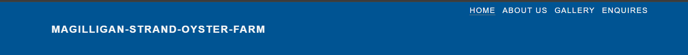

The header contains the business title and fully responsive nav bar to the right of the screen. The Nav bar becomes a burger icon for smaller devives sizes

It contains links to all pages to facilite ease of navigation. An underline is highlighted on mouseover

 
Footer

 
 
The footer keeps the same color sheme as the header and contains all the social media link for the business

  <li>Landing Page</li>
  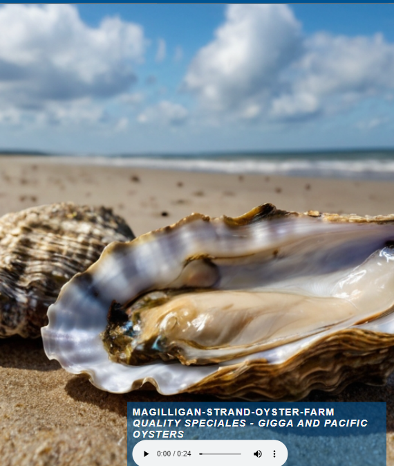
  
The landing page presents a clear indication on what the website is about. It show an open oyster on a sandy beach with a blue sky behind

  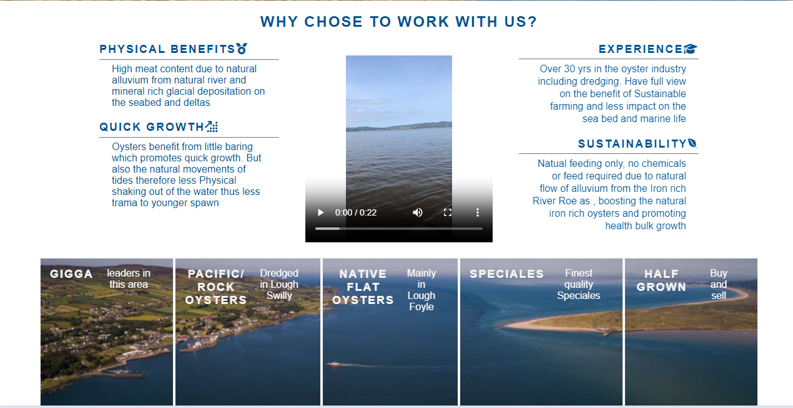
  
Contains text about the reasons why

  <li>About Us</li>
  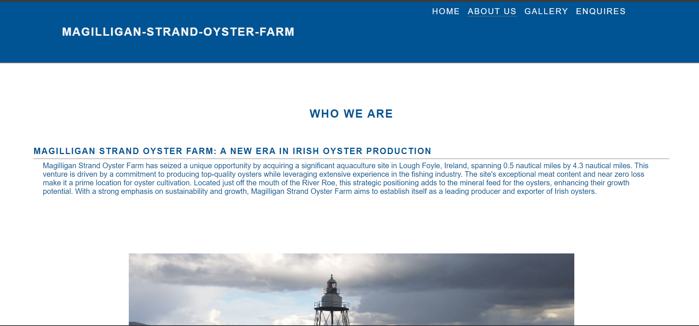
  
As the site is an informational site for potential buyers, this contains a lot of information about the company and its team and its USPs

  
  <li>Gallery</li>
  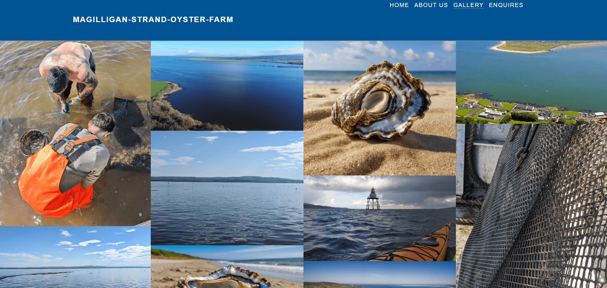
  
The Gallery contains images of the area of the farm and of the workers

  <li>Enquires</li>
    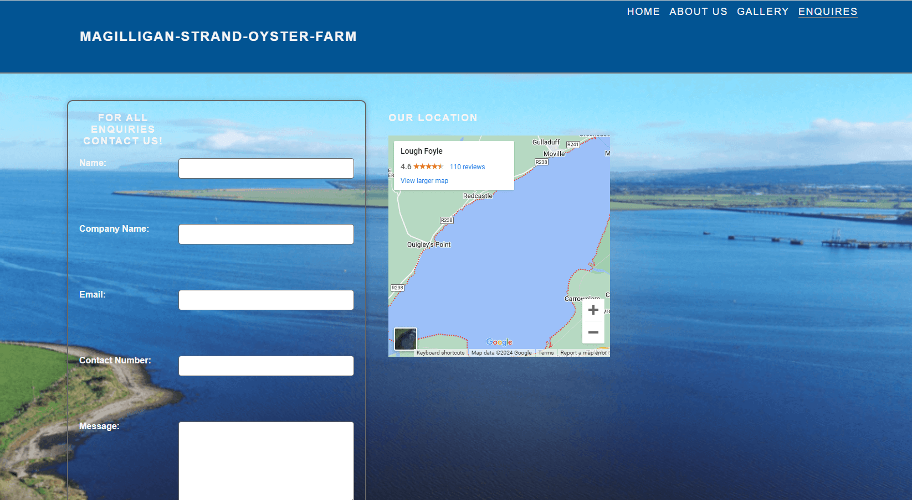

The contacts page contains input areas for data capture for customers to contact the company

 ## Technologies Used
 <ol>
<li>Languages Used</li>
<li>Frameworks, Libraries and Programs Used</li>
</ol>

### Languages used
<ul>
<li><a href="https://en.wikipedia.org/wiki/HTML5" rel="nofollow">HTML5</a></li>
<li><a href="https://en.wikipedia.org/wiki/CSS" rel="nofollow">CSS3</a></li>
</ul>

### Frameworks, Libraries and Programs Used
<ul>
<li><a href="https://fontawesome.com/" rel="nofollow">Font Awesome</a></li>

This was used to get decorative icons. 

<li><a href="https://fonts.google.com/" rel="nofollow">Google Fonts</a></li>

This was used to select font styles for the CSS file. 

<li><a href="https://balsamiq.com/" rel="nofollow" alt="balsamiq">Balsamiq</a></li>

This was used to create a wireframe for the project.

<li><a href="https://github.com/" alt="github">GitHub</a></li>

Github was used to store and share the project. But it was also used in conjunction with vs to create the majority of the site.

<li><a href="https://gitpod.io/" rel="nofollow" alt="gitpod">GitPod</a></li>

This was set up and helped to create the site.

<li><a href="https://tinypng.com/" rel="nofollow" alt="tinypng">TinyPNG</a></li>

This was used to compress my images to improve loading time. 

<li><a href="http://ami.responsivedesign.is/#" rel="nofollow" alt="am-i-responsive">Am I Responsive?</a></li>

This was  used to give a visual idea of what the site would look like on different screens.

Used to test the sites responsiveness on differnt devices.

<li><a href="https://developer.chrome.com/docs/devtools/" rel="nofollow" alt="chrome-dev-tools">Chrome DevTools</a></li>

Used throughout the project to review code and test reponsiveness.

<li><a href="https://validator.w3.org/" rel="nofollow" alt="html validator">W3C Markup Validator</a></li>

This was used to validate the html in the website.

<li><a href="https://jigsaw.w3.org/css-validator/" rel="nofollow" alt="CSS validator">W3C CSS Validator</a></li>

This was used to validate the CSS in the website. 

</ul>

### Testing

<ol>
<li><strong>Testing User Stories</strong></li>

As a customer, I want be able to navigate through the website clearly

<ul>
<li>The website has been design to give easy navigation to the user. Each page contains the same layout to make navigation a simple process. </li>
</ul>

As a customer, I want to understand what quality the product are and how this is achieved.

<ul>
<li>The benifits and products are referred to on the landing page. With deep information given on the About us page.</li>
</ul>

As a customer, I want to be able to contact the company to clarify information and negotiate sales.

<ul>
<li>A dedicated contact page has been set up for customer to give brief message and who they are. It would be intended this would like directly to office enquires.</li>
</ul>

As a customer, I want to find social media links to the business.

<ul>
<li>Social media links are on the footer of every page. This unity of pages ensures ease of use for customer and therefore better UX.</li>

<li><strong>Code Validation</strong></li>

W3C Markup validator and W3C CSS validator were used to find any synax errors in code. 

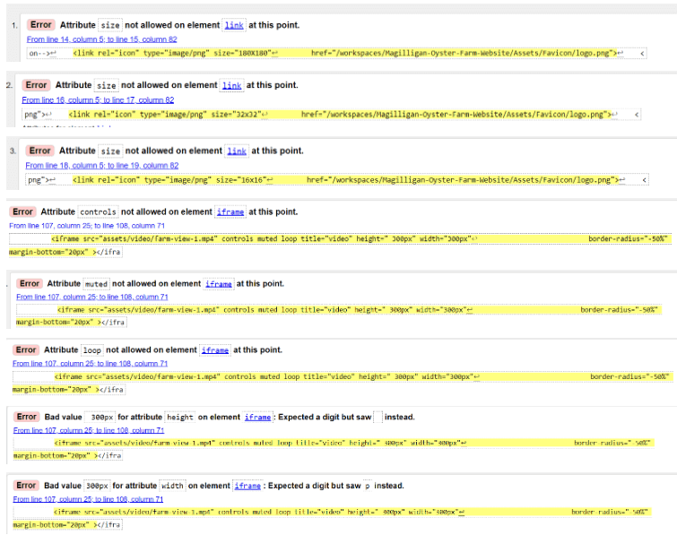
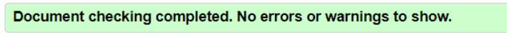
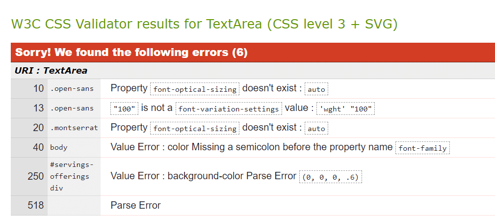

<li><strong>Accessibility</strong></li>

Lighthouse in google dev tools was used to check accessability

<ul>
<li>Landing Page</li>

<li>About Us</li>
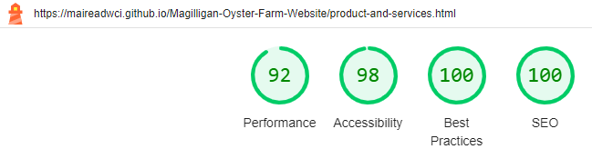
<li>Gallery</li>
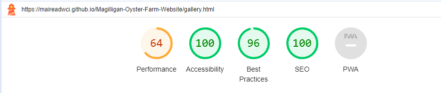
<li>contact</li>
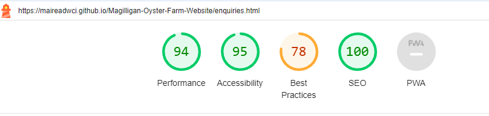
</ul>

<li><strong>Tools Testing</strong></li>

Chrome dev tools was mainly used throughout the project to modigy and explore the elements and styles.

<li><strong>Manual Testing</strong></li>

Am I responive and chrome dev tools were used to check display sizes thoughout creation of website. 

Responsiveness testing
Using the following site tested reponsiveness https://ui.dev/amiresponsive

 html and Css checked on https://validator.w3.org/nu/ and https://jigsaw.w3.org/css-validator/#validate_by_input
 
</ol>

### Finished Product
#### Landing Page
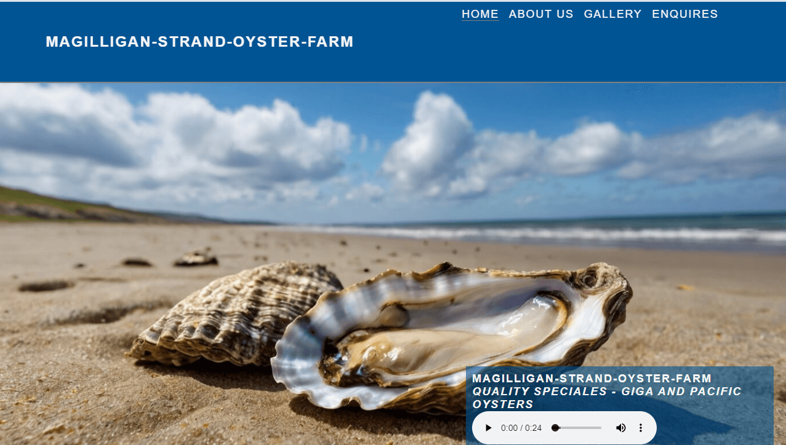
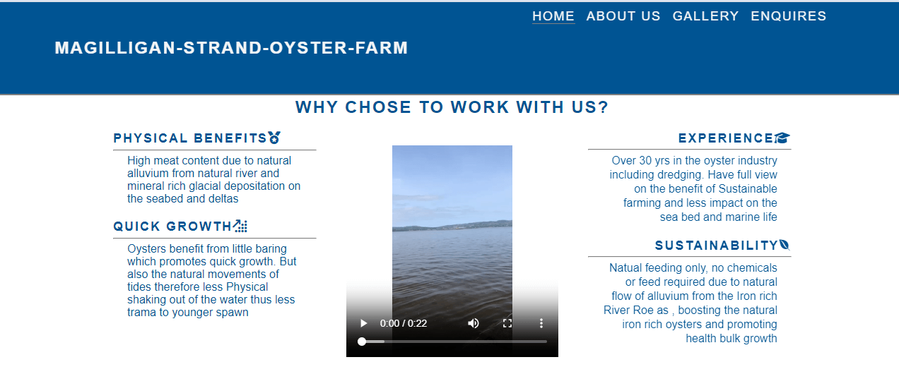
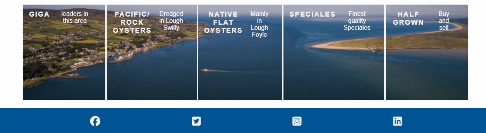

#### About Us Page
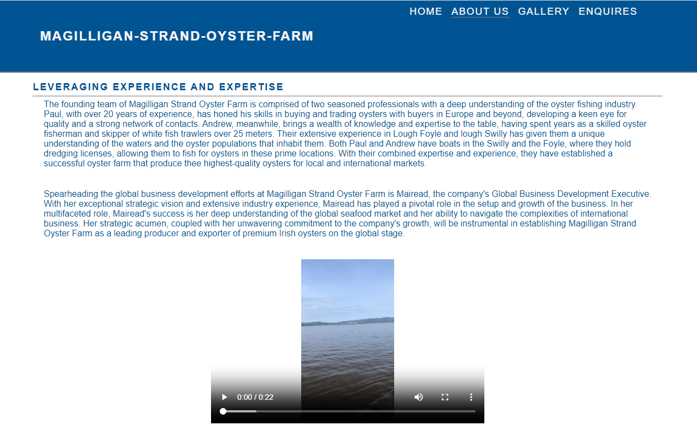
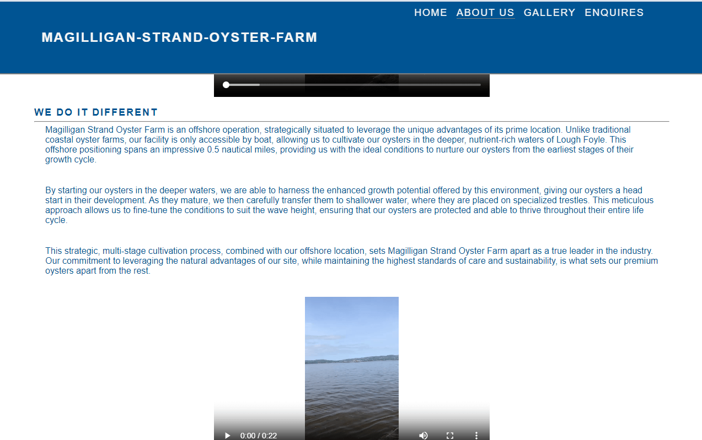
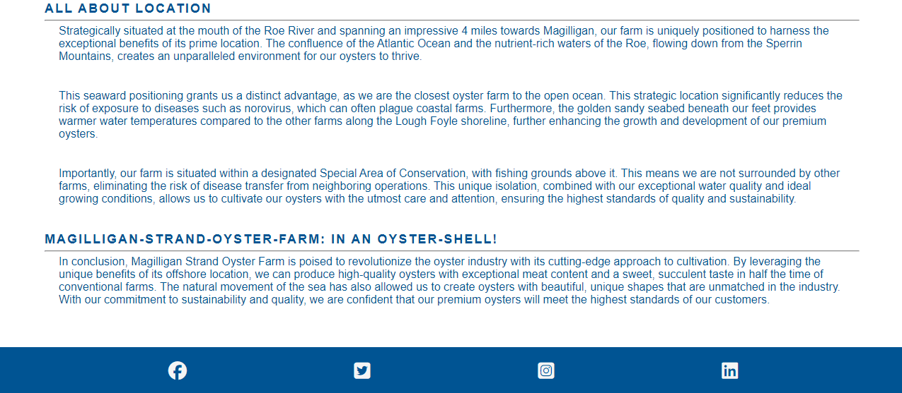

#### Gallery 
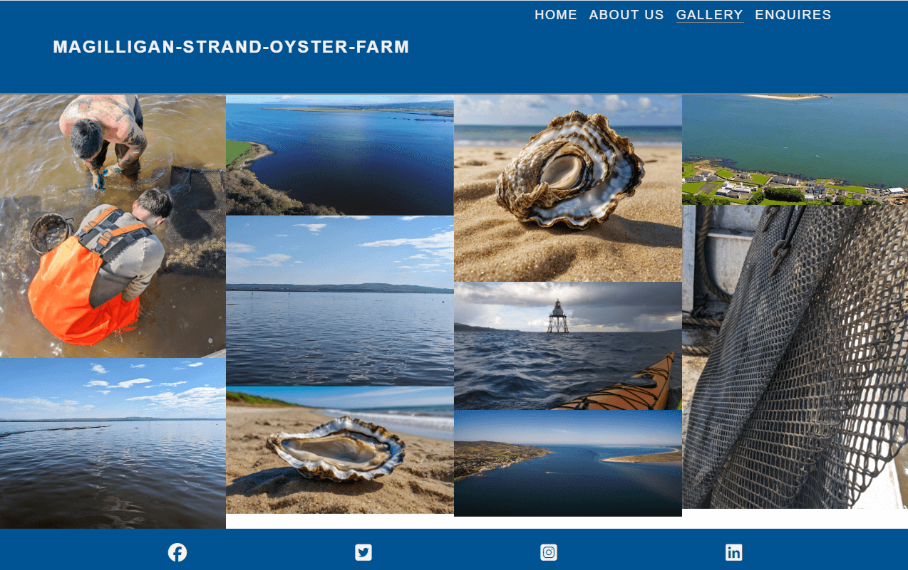

#### Enquires
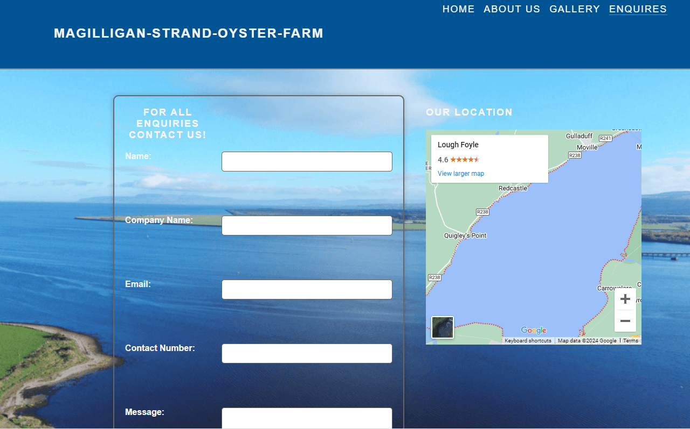
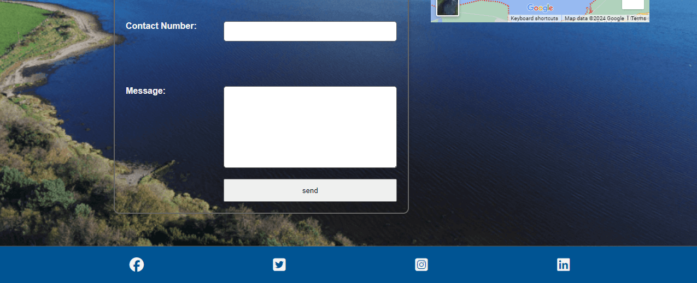

### Deployment

 
 Github deployed pages</a>

 
Repository

### Looking forward

This site is to be used for an actual company that require updated vidoes and pictures. Most are genuine picture but some are placeholders. Drone footage is scheduled and will be uploaded to site.

The contact section will need the appropriate coding added to link directly to the companies site. 

The gallery section as stated above will be updated with new imanges and at that time will make the main and the footer more seamless across all devices.

Map location is not exactly how I would like it to respond. I intend on working on its positioning so It is more aligned to the right of the display in larger screen sizes.

### Credits
<ol>
<li>leonardo.ai for images</li>

 https://app.leonardo.ai/image-generation used for Hero image  
 

<li>Balsamiq for wireframes</li>
<li>Perplexity to check errors</li>
<li>Pixabay for audio effects</li>
<li>Stack Overflow and W3Schools</li>
</ol>

### Acknowledgements

<ul>
<li>Marcel my tutor for being straight and informative.</li>
<li>My facilitator Lewis for being a fantastic support.</li>
</ul>

Site deployed https://maireadwci.github.io/Magilligan-Oyster-Farm-Website/index.html

 
